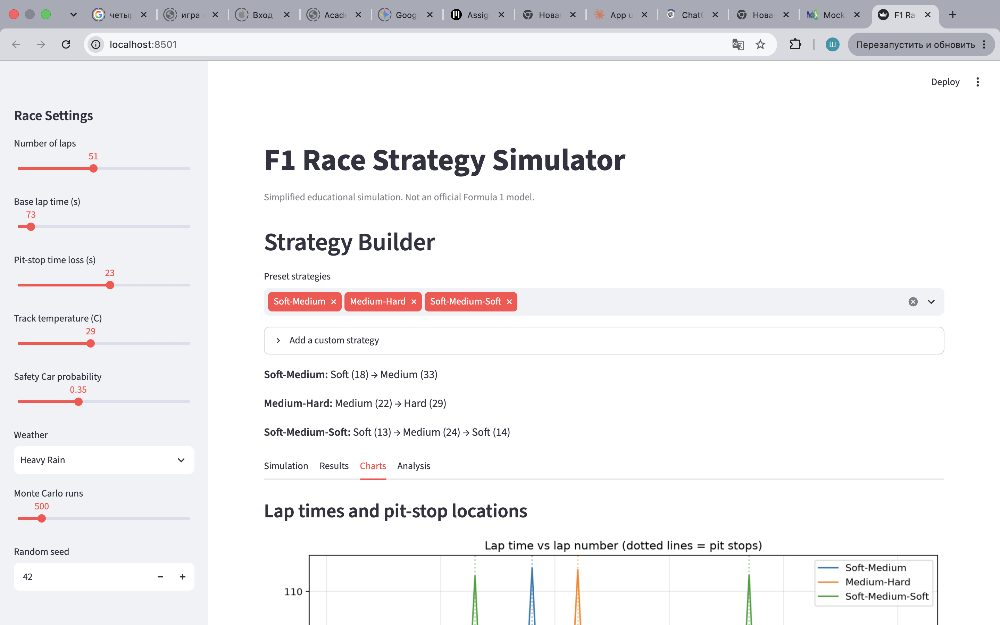
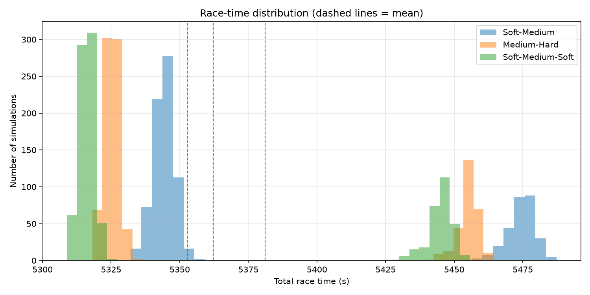
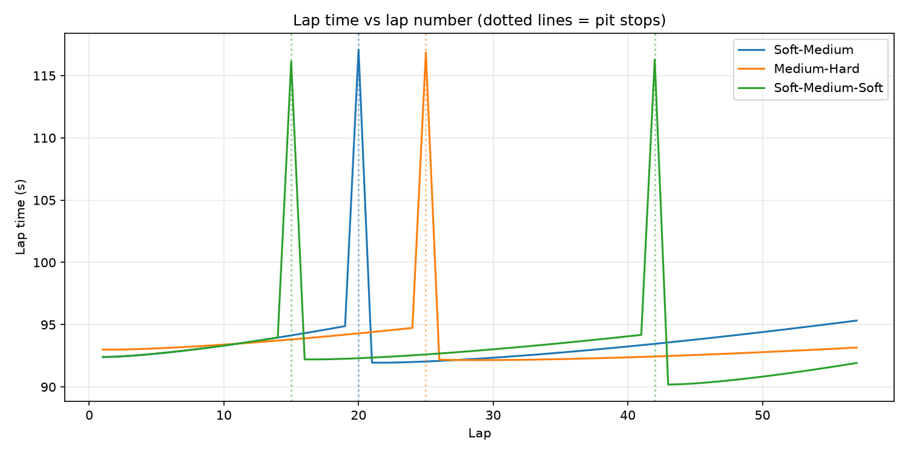
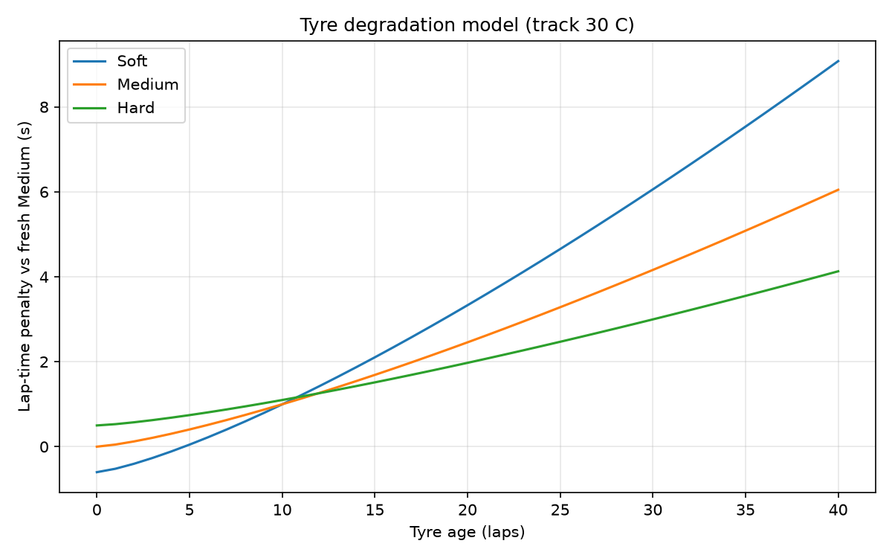
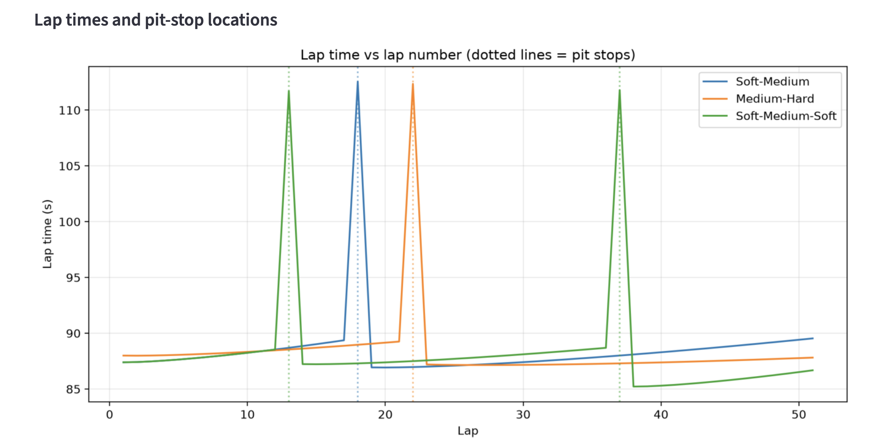

# F1 Race Strategy Simulator

A Monte Carlo simulation of Formula 1 pit-stop and tyre strategies, with an interactive Streamlit dashboard.

> **Educational project.** This is a simplified simulation. It is not an official Formula 1 model and does not reproduce the proprietary models used by F1 teams.



## Overview

The simulator compares tyre strategies (for example Soft→Medium, Medium→Hard, Soft→Medium→Soft) by running each one thousands of times with random conditions, then reporting the expected race time and the risk.

## Motivation and problem statement

A single simulated race gives one number, which hides uncertainty. Safety Cars, weather and tyre wear change the outcome. The goal is to estimate not only which strategy is faster on average, but how much its result can vary.

## Features

- Configurable race: laps, base lap time, pit-stop loss, track temperature, fuel load
- Tyre degradation model (Soft, Medium, Hard)
- Weather scenarios: Dry, Light Rain, Heavy Rain, Changing
- Probabilistic Safety Car (configurable probability)
- Monte Carlo simulation with reproducible random seeds
- Preset and custom strategies
- Statistics: mean, median, standard deviation, fastest, slowest, probability below a time threshold, P95 minus median
- Charts: lap times with pit stops, tyre degradation, race-time distribution, strategy comparison, weather effect
- Unit tests with pytest

## Technologies

Python, NumPy, Pandas, Matplotlib, Streamlit, pytest, Git.

## Mathematical model

Lap time for lap n on a tyre of age a:

```
T(n) = T0 + beta * m(n) + offset_c + d_c * a^1.3 * f(T_track) + W(weather, n)   [+ noise]
```

- `T0`: base lap time
- `m(n) = m0 - r * (n - 1)`: fuel mass, `beta = 0.03 s/kg`
- `offset_c`: compound offset (Soft -0.6 s, Medium 0, Hard +0.5 s)
- `d_c`: degradation rate (Soft 0.08, Medium 0.05, Hard 0.03 s per lap^1.3)
- `f(T_track) = 1 + 0.1 * (T_track - 30) / 10`: hotter track wears tyres faster
- `W`: weather penalty on dry tyres (Light Rain +4 s, Heavy Rain +12 s per lap)
- Safety Car: laps are multiplied by 1.35, pit-stop loss is halved
- Noise: Gaussian with standard deviation 0.2 s

Total race time is the sum of lap times plus pit-stop losses. All coefficients are illustrative values chosen for this educational model, not fitted to real data.

## Simulation and Monte Carlo methodology

Each Monte Carlo run draws random lap noise, a random track temperature (normal around the chosen value) and, with the chosen probability, one 4-lap Safety Car period at a random lap. A master random generator with a fixed seed produces every run's seed, so results are reproducible.

## Results (example)

Settings: 57 laps, Safety Car probability 30%, dry, 1000 runs.

| Strategy | Pit stops | Mean (s) | Std (s) |
|---|---|---|---|
| Soft-Medium | 1 | ~4558 | ~59 |
| Medium-Hard | 1 | ~4548 | ~59 |
| Soft-Medium-Soft | 2 | ~4542 | ~58 |

Key observations:

- The race-time distribution is **bimodal**: one group of races without a Safety Car and a slower group with one. The mean falls between the two groups, so it does not describe a typical race.
- Within each group the strategies differ by roughly 10-20 s, but the Safety Car shifts results by more than 100 s. In this model, Safety Car timing is a larger source of risk than tyre choice.
- Differences between mean times are small compared with the spread, so the ranking of strategies is not reliable on the mean alone.






## Limitations and Assumptions

- This is an educational simulation and does not reproduce the proprietary models used by Formula 1 teams.
- All coefficients are illustrative and not calibrated on real telemetry.
- No traffic, overtaking, drivers, car differences, tyre temperature or track evolution.
- Only dry tyres are modelled, so rain only adds a penalty.
- At most one Safety Car of fixed length per race; no virtual Safety Car or red flags.
- Pit strategies are fixed in advance and do not react to race events.
- Only one car is simulated, without competitors.

## Future improvements

- Calibrate parameters using public data (for example the FastF1 library)
- Intermediate and wet tyres and reactive strategies
- Strategy optimisation over pit-stop laps
- Multi-car simulation with traffic
- Sensitivity analysis of model parameters

## How to run

```bash
git clone https://github.com/shaxammm/f1-race-strategy-simulator.git
cd f1-race-strategy-simulator
python3 -m venv .venv
source .venv/bin/activate        # Windows: .venv\Scripts\activate
pip install -r requirements.txt

python -m pytest                 # run tests
streamlit run app.py             # start the dashboard
python make_plots.py             # regenerate charts in screenshots/
```

## Project structure

```
app.py               Streamlit dashboard
src/models.py        Data structures (RaceConfig, Stint, Strategy)
src/tyres.py         Tyre degradation model
src/weather.py       Weather scenarios
src/safety_car.py    Safety Car model
src/simulation.py    Race simulation
src/analysis.py      Monte Carlo and statistics
src/plots.py         Charts
tests/               pytest unit tests
screenshots/         Images used in this README
```
